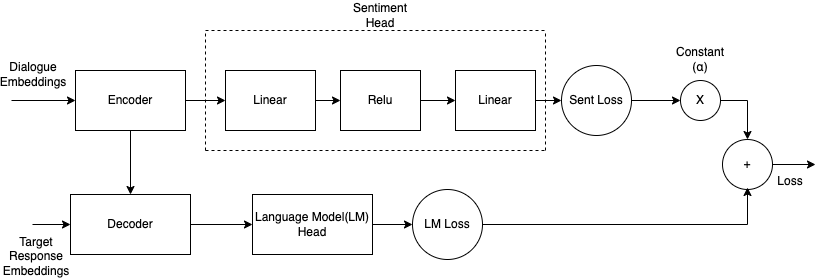

# Mental health dialogue system for emotional well-being (Novel T5)
> **Note:** This work the project was part of the course work for Advanced Natural Language Processing (CS685) at UMass, Amherst.

## Approch
Our approach is based on the assumption that an empathetic conversational agent should mirror the emotion of the speaker . We propose to use a mode that favors sentiment understanding and empathetic response generation using the sentiment of each dialogue context. It is based on the Text-to-Text Transformer (T5) and we extend it with a sentiment analysis model and weighted loss during training, in order to apply sentiment understanding and enforce empathetic response generation.

## Novel T5 Architecture



## Output

| Input| T5 (Baseline) |  Novel - T5   | Gold Response |
| --- | --- | --- | --- |
| I was bowling last week and I accidentally <br> used the person's custom ball that was next | Oh no! That's so embarrassing! | Oh no! What happened? | oh, how he reacted next |
|I found an injured bird in my yard today, <br> it was only a baby too!| Oh no! What happened? | I am sorry to hear that. Did you get it to come home? | How terrifying. I hope you were able to find and kill it |
|I woke up needing to use the bathroom at <br> midnight. As soon as I sit down a giant bug flew <br> into my face! I screamed so loud that I woke up <br> my husband and he though we were being burgled! | I am sure he was scared. | That is horrible. I hope you were able to sleep well. | Did you help it? |
| I am terrified that my wife is going to leave me. <br> Why would she leave you? Because she is talking <br> to other men behind my back | I am sure she will. | That is a very scary thought. | oh no, i'm so sorry to hear that. I know your heart is broken. <br> Did you try to talk to her about it? | 

## Details
[ Dataset ](./experiments/data/empatheticdialogues) - Empathetic Dialogues <br>
[ Train Novel T5](./experiments/train_novel_T5.py) - Training Novel T5 model <br>
[ Test Novel T5](./experiments/test_novel_T5.py) - Testing Novel T5 model <br>
[ Output ](./Output) - Generated Text <br>
[ gpt2.zip ](./gpt2.zip) - It is model where picked up most of the base code and modified it to work for T5 ( [Source](https://github.com/devjwsong/gpt2-dialogue-generation-pytorch) ) <br>
[ paper ](./paper.pdf) - Refer paper for more details.

## Setup 
```
Step 1. - pip install -r requirements.txt 
Step 2. - python ./experiments/train_novel_t5.py  --batch-size=4 --epochs=50  --multitask1=0.8 --ckpt=yourcheckpoint 
Step 3. - python ./experiments/test_novel_t5.py --modelckpt=yourcheckpoint
```

## Authors
> Subramanya N - snagabhushan@umass.edu <br>
> Shashank Srigiri <br>
> Venkata Bramara Parthiv Dupakuntla
